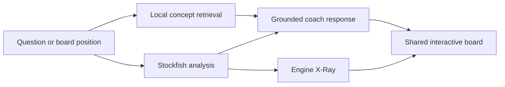

# Chess Academy Study Lab — Implementation and Progress Plan

Last updated: 2026-07-30
Starting commit: `7ba3379` (`main`)
Plan owner: Codex + project maintainer

## Status snapshot

- Overall status: **Pilot implemented; release hardening in progress**
- Current release slice: **R6 — Pressure test, accessibility, and release readiness**
- Current task: **R6.7/R6.9/R6.10 — finish the manual accessibility and engine-failure matrix**
- Next validation gate: **Keyboard-only, reduced-motion, and degraded-engine walkthroughs**
- Blocking issues: **None**

This file is the durable handoff point for work that spans multiple sessions. Update the snapshot,
checkboxes, decision log, validation record, and session log before ending every implementation
session.

## Product outcome

Build one integrated study room with two complementary lenses:

1. **Engine X-Ray** teaches reusable computer-analysis habits by exposing Stockfish's candidate
   moves, iterative deepening, principal variations, classical evaluation terms, and strongest
   replies.
2. **The Ghost of Nimzowitsch** is a clearly fictional, book-grounded coach that retrieves
   original concept cards, relates them to the current position, and cites the relevant chapter
   without inventing book claims or chess analysis.

The engine owns calculation. Curated content owns historical and strategic claims. The coach
connects the two but never substitutes generated prose for chess truth.



## Constraints and guardrails

- Preserve the current React/Vite/Tailwind architecture and GitHub Pages compatibility.
- Keep the core experience static, client-side, account-free, and free of recurring AI costs.
- Load Stockfish lazily and run it in a Web Worker.
- Do not add an LLM, embeddings service, vector database, agent framework, or public API key in the
  first release.
- Do not ship, index, quote from, or import the local Quality Chess translation or its OCR.
- Use only original summaries, verified chess positions, and chapter-level source references in the
  public application.
- Treat the ghost as a fictional teaching persona, not an authentic reconstruction of a historical
  person.
- Label engine principal variations as current leading lines, not predictions or the complete
  internal search tree.
- Label Stockfish's `eval` output as a static classical evaluation, not a causal explanation.

## Architecture contracts

### Engine analysis result

The analysis boundary should expose stable application data rather than raw UCI strings:

```text
fen
status: idle | loading | searching | complete | error
depthSnapshots[]
  depth, selectiveDepth, nodes, nps, elapsedMs
  lines[]
    rank, score, mate, uciMoves[], sanMoves[]
staticEvaluation
  material, imbalance, initiative, pawns, pieces
  mobility, kingSafety, threats, passedPawns, space, total
bestMove
```

### Coach knowledge card

```text
id
title
chapter
part
aliases[]
questions[]
summary
principles[]
applicationPrompts[]
positionIds[]
relatedCardIds[]
sourceLabel
```

Cards contain newly authored prose only. Private source-page notes may exist outside `src/`, but
they must never be copied into the public card or bundle.

### Coach response

Every response must include:

- a direct answer assembled from retrieved card content;
- a visible chapter/source chip;
- an honest fallback when confidence is low;
- optional board-specific engine facts only when analysis is available;
- suggested follow-up prompts drawn from the selected cards.

## Release map

### R0 — Durable plan and baseline

- [x] R0.1 Audit the repository, engine integration, dormant lesson UI, and local materials.
- [x] R0.2 Confirm the local PDF is a modern Quality Chess translation and must remain private.
- [x] R0.3 Verify the bundled Stockfish supports MultiPV, iterative `info`, and classical `eval`.
- [x] R0.4 Create this persistent plan and progress ledger.
- [x] R0.5 Record baseline test, lint, content-validation, and production-build results.

Gate R0: the starting state is known, clean, and reproducible.

### R1 — Restore the study foundation

- [x] R1.1 Restore `/my-system` and `/lesson/*` from the last working implementation in Git history.
- [x] R1.2 Restore the lesson presentation components and glossary linking needed by those routes.
- [x] R1.3 Restore the My System chapter map using original project prose.
- [x] R1.4 Add study-room navigation without weakening the Arena as the main landing experience.
- [x] R1.5 Confirm progress recording still works with restored lesson routes.
- [x] R1.6 Add or restore route and rendering tests.

Gate R1:

- My System opens from the Arena.
- Every linked existing lesson renders, accepts its intended interaction, and records completion.
- Planned chapters are visibly planned rather than broken links.
- No copyrighted material enters tracked files or the production bundle.

### R2 — Engine X-Ray core

- [x] R2.1 Add a pure parser for iterative UCI `info` lines.
- [x] R2.2 Add a pure parser for Stockfish 10 classical `eval` traces.
- [x] R2.3 Add fixtures and unit tests for centipawn, mate, bounds, MultiPV, and malformed lines.
- [x] R2.4 Add a cancellable, sequential analysis API with `MultiPV=3`.
- [x] R2.5 Convert each principal variation from UCI to SAN using `chess.js`.
- [x] R2.6 Preserve one snapshot per completed depth and normalize scores to the learner's view.
- [x] R2.7 Add a dedicated React hook with stale-result protection and session-level caching.
- [x] R2.8 Keep analysis separate from weakened gameplay settings; teacher analysis uses full skill.

Gate R2:

- A known FEN returns three ranked legal candidate lines and a parsed classical evaluation.
- Reset/unmount cannot leak a stale result into a new position.
- A worker failure produces a recoverable, accessible error state.

### R3 — Engine X-Ray tutorial UI

- [x] R3.1 Add `/study/engine-xray` and an Arena entry card.
- [x] R3.2 Build “Your Scan”: select up to three candidate moves and predict the best reply.
- [x] R3.3 Build “Position X-Ray”: readable middle-game/endgame factor bars.
- [x] R3.4 Build “Search Time Machine”: scrub through saved depth snapshots.
- [x] R3.5 Build the three-branch search bonsai with evaluation and leader-change indicators.
- [x] R3.6 Add principal-variation playback, board arrows, and “Refutation Radar.”
- [x] R3.7 Add a human debrief comparing the learner's candidates with Stockfish's leading lines.
- [x] R3.8 Seed six curated positions spanning tactics, prophylaxis, blockade, open files, pawn
  chains, and endgames.

Gate R3:

- A learner can complete the full predict → reveal → inspect → replay → debrief loop by keyboard,
  pointer, or touch.
- The UI never calls the visible bonsai a complete search tree.
- Engine loading does not block the rest of the site.

### R4 — Grounded Nimzowitsch coach

- [x] R4.1 Add 6 pilot concept cards: center/development, open files, blockade, pawn chains,
  prophylaxis, and overprotection.
- [ ] R4.2 Expand to 40–80 reviewed cards only after the pilot interaction proves useful.
- [x] R4.3 Add a small deterministic weighted lexical retriever with aliases and confidence.
- [x] R4.4 Add retrieval tests for canonical terms, synonyms, misspellings, ambiguity, and no-match.
- [x] R4.5 Build the fictional ghost coach panel with prompt chips and free-text questions.
- [x] R4.6 Add chapter/source chips, “nearest concept” fallback language, and follow-up prompts.
- [x] R4.7 Make the current board and selected engine line available as optional coach context.
- [x] R4.8 Ensure engine facts and book concepts are visually distinguishable.
- [x] R4.9 Add a content-lint test that rejects suspiciously long source-like passages.

Gate R4:

- The six pilot concepts answer representative questions without an LLM or network call.
- Every substantive book answer displays its source chapter.
- Unknown questions fail honestly and suggest nearby supported concepts.
- No raw OCR, modern editorial essay, or private-source text is bundled.

### R5 — Integrated Study Lab

- [x] R5.1 Add “Ask the ghost about this branch” from Engine X-Ray.
- [x] R5.2 Add “Analyze this position” from each playable My System study.
- [x] R5.3 Preserve the current FEN and orientation while switching lenses.
- [x] R5.4 Save local study progress without storing private question content remotely.
- [x] R5.5 Add clear boundaries for opening questions: principle-based interpretation, not a
  repertoire database.
- [x] R5.6 Write concise in-product explanations of static evaluation, search depth, selective
  depth, PVs, and engine uncertainty.

Gate R5:

- A learner can move from book concept → board exercise → engine analysis → grounded coach
  discussion without re-entering the position.
- Refresh and back/forward navigation preserve a sensible study state.

### R6 — Pressure test, accessibility, and release readiness

- [x] R6.1 Run full unit/integration test suite.
- [x] R6.2 Run lint with zero warnings.
- [x] R6.3 Run content validation.
- [x] R6.4 Run production build and inspect bundle warnings.
- [x] R6.5 Exercise all new routes in a real browser.
- [x] R6.6 Test narrow mobile, tablet, laptop, and wide desktop layouts.
- [ ] R6.7 Test keyboard-only navigation and visible focus.
- [x] R6.8 Test screen-reader names/status announcements for engine progress and coach replies.
- [ ] R6.9 Test reduced motion and avoid animation-dependent understanding.
- [ ] R6.10 Test slow engine startup, cancellation, invalid FEN, no WebAssembly, worker error, and
  rapid position switching.
- [x] R6.11 Test retrieval injection-like text, nonsense questions, unsupported openings, and
  copyright-excerpt requests.
- [x] R6.12 Confirm no `materials/` path or text is present in the built output.
- [x] R6.13 Update README, third-party notes, and contributor guidance.

Gate R6: all critical paths pass, no high-severity accessibility or correctness issue remains, and
known limitations are documented.

## Pressure-test matrix

| Area | Representative checks | Evidence to record |
| --- | --- | --- |
| Chess correctness | Legal PV moves, SAN conversion, side-to-move score normalization, mate scores | Unit tests and curated FEN fixtures |
| Engine lifecycle | Lazy load, cancellation, rapid restart, stale responses, timeout, worker failure | Hook tests and browser run |
| Pedagogy | Candidate prediction before reveal, best-reply emphasis, static-vs-search distinction | Manual walkthrough notes |
| Coach grounding | Correct card, source chip, low-confidence fallback, no invented quote | Retrieval tests and browser transcript |
| Copyright | No OCR imports, no modern essay cards, no long copied passages, clean build scan | `rg` scan and content-lint test |
| Accessibility | Keyboard, focus, announcements, contrast, reduced motion, touch targets | Browser checklist |
| Responsive UX | 320 px through wide desktop; no clipped board, chart, or chat | Browser viewport checklist |
| Performance | App interactive before engine load; bounded depth/MultiPV; cached repeat FEN | Browser timing notes |
| Regression | Arena, engine game, scenarios, online lobby, profiles | Existing and new tests |

## Known risks

| Risk | Mitigation | Status |
| --- | --- | --- |
| Raw engine output is mistaken for an explanation | Separate “measurement,” “leading line,” and authored interpretation labels | Controlled |
| MultiPV slows mobile devices | Default to three lines, bounded depth, lazy start, cancellation, and a session cache | Mitigated |
| Stockfish 10 is old | Use it deliberately for interpretable classical evaluation; document version | Accepted |
| Coach feels repetitive without generation | Strong cards, aliases, follow-ups, board context, and honest scope | Pilot to evaluate |
| OCR chess notation is corrupt | Never ingest OCR moves; manually verify positions with `chess.js` | Controlled |
| Restored UI conflicts with newer Arena styling | Adapt restored behavior to current components and tokens | Resolved |

## Validation record

| Date | Commit/worktree | Tests | Lint | Content | Build | Browser | Notes |
| --- | --- | --- | --- | --- | --- | --- | --- |
| 2026-07-30 | `7ba3379` baseline | 223 passed | Pass | 20 files / 50 terms | Pass with existing 500 kB chunk warning | Pending | Clean baseline before feature work |
| 2026-07-30 | Feature worktree | 292 passed | Pass | 20 files / 50 terms | Pass; 1.27 MB JS / 352 kB gzip, existing 500 kB warning | Pass with follow-ups | Real Stockfish reached depth 11/MultiPV 3; 320 px overflow found and fixed; 320/768/1280/1440 widths clean; no private-source strings in `dist/` |

## Decision log

- **2026-07-30 — No agentic RAG for the first release.** One curated book does not justify an
  agent framework, vector store, or recurring model cost.
- **2026-07-30 — Keep public content original.** The local Quality Chess OCR remains private and is
  never part of retrieval in the shipped app.
- **2026-07-30 — Use Stockfish 10 as a teaching asset.** Its classical evaluation trace is more
  interpretable than a modern neural evaluator, even though it is weaker than current Stockfish.
- **2026-07-30 — Show a search bonsai, not a fake full tree.** The UI visualizes MultiPV and current
  principal variations with explicit scope labels.
- **2026-07-30 — Start with six concept cards and six positions.** Validate the interaction before
  expanding the corpus.
- **2026-07-30 — Preserve the predict-before-reveal constraint.** Stockfish stays disabled until
  the learner supplies at least one legal candidate; keyboard users receive a native legal-move
  picker instead of having to operate the visual board.
- **2026-07-30 — Keep the portrait original and the persona explicit.** The coach uses a newly
  generated editorial illustration and is always labeled as fictional.

## Session log

### 2026-07-30 — Planning and audits

- Audited current routes, dormant lesson machinery, Stockfish worker, content schema, materials,
  licensing, and Git history.
- Verified MultiPV, iterative UCI output, and classical evaluation trace against the bundled engine.
- Chose the integrated Study Lab architecture and created this durable plan.
- Restored the My System chapter map, linked lessons, glossary behavior, and progress recording.
- Added the full-strength cancellable MultiPV analysis core, classical evaluation parser, session
  cache, and focused tests.
- Built the Engine X-Ray predict → reveal → scrub → replay → debrief loop around six curated
  positions.
- Added six original coach cards, deterministic retrieval, source chips, honest fallbacks, selected
  branch context, and an original ghost portrait.
- Connected every playable lesson to Engine X-Ray with FEN/orientation context.
- Pressure-tested the real worker and integrated flow in the browser. Fixed the 320 px board
  overflow and added a native move picker after identifying the keyboard gap.
- Ran the complete gates: 292 tests, zero-warning lint, content validation, production build, and a
  clean private-material scan.
- Next action: complete R6.7, R6.9, and the remaining degraded-engine cases in R6.10 before calling
  the pilot release-ready.

## End-of-session handoff checklist

- [x] Update “Status snapshot.”
- [x] Check completed task IDs and leave incomplete work unchecked.
- [x] Add validation results with exact failures or limitations.
- [x] Add decisions that future sessions should not reopen without new evidence.
- [x] Add a dated session-log entry.
- [x] Leave the worktree in a known state and list any unrelated pre-existing changes.
- [x] Name the single best next action.

Known worktree state: all current modifications belong to this Study Lab implementation; no
unrelated pre-existing edits were identified. The implementation is scoped as one release commit.
